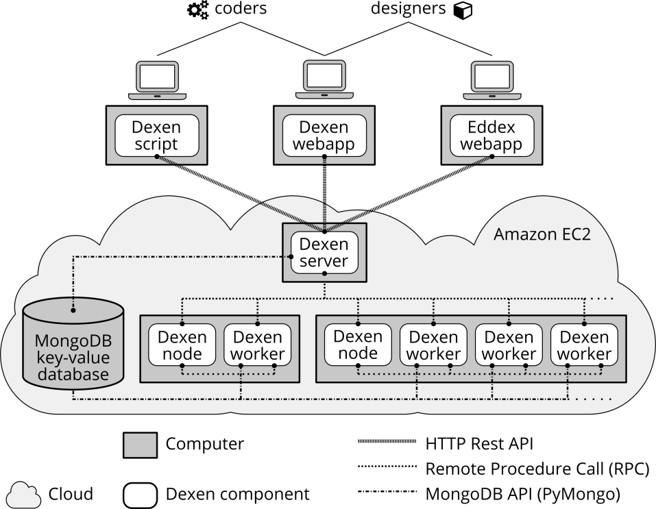

Dexen is an execution environment for running computationally demanding jobs on distributed computing resources. These include cloud based infrastructures such as Amazon EC2.

Dexen consists of a number of components that run on networked computers in the cloud. The three main components are: a server computer that is the core of the system and manages all communication; one or more node computers that have workers that execute the actual tasks defined by the job; and one database that is used to store all data associated with the running job.

