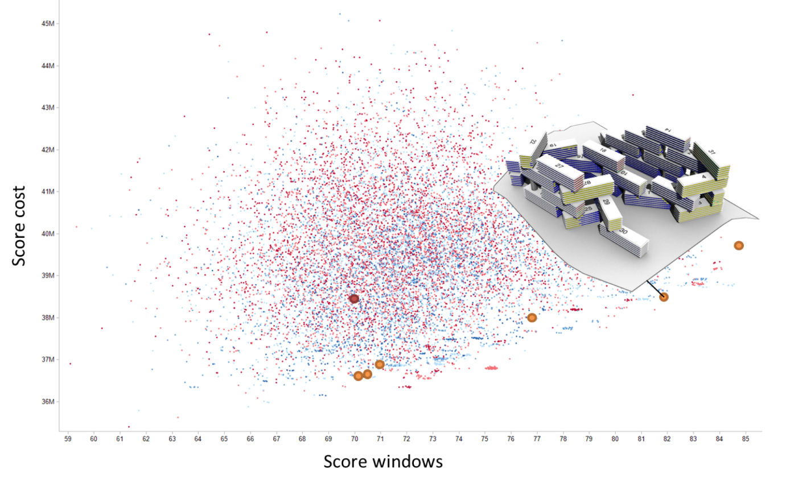

# Overview

Dexen allows end users to run computationally demanding jobs on distributed computing resources. These jobs can have complex dependencies, including arbitrary resources and other existing software systems. For example, jobs can be executed that rely on APIs and respurces provided by third-part 3D modelling or simulation software.

Within Dexen, a job consists of a set of tasks that get triggered when data objects become available. The end user can develop a set of tasks and uploaded them to the server. The system will schedule and execute the tasks on a set of workers in parallel, with all data input and output automatically being stored in the database. The user is then able to view the data in the database, for example in order to download results that have been evolved.

Dexen has an inbuilt flexibility and robustness due to the fact that the tasks only communicate via data. This allows the system to automatically discover which tasks to execute at any time. Each task can be executed multiple times and can create, modify, and delete data objects. Such data objects may contain any type of data – from simple types to arbitrary blobs of data, such as 3D models of design variants saved as files.

This fleibility makes Dexen ideal for running optimisation jobs. For example, in order to run an evolutionary optimization algorithm, the end-user can define and upload the tasks for the evolutioonary process, including development, evaluation, and feedback. These tasks will then be executed by as an when data becomes available in the database: the development task when new genotypes are added to the database, the evaluation task when unevaluated phenotypes are added to the database, and the feeback task when the population has grown enough to allow selection and reproduction to be performed.

*Example of a Pareto graph showing a population of building designs evoled using Dexen. (The example is based on the [Interlace](http://oma.eu/projects/the-interlace) in Singapore.)*

Creating tasks still requires the user to write code. This is challenging for end-users with limited programming skills. To address this, a tool has been created to partically automate the creation of tehse various procedures. For more information, see the Eddex site.
